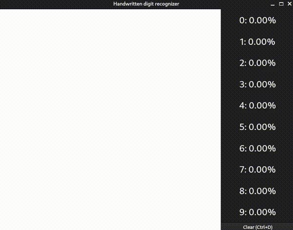

# Handwritten digit recognizer

This repo contains a Convolutional Neural Network implementation for the MNIST dataset, achieving a 99.21% test data accuracy. It also has an interactive PyQT GUI for real-time digit classification.

## Demo


> [!Note]
> In the demo, it operates in release mode; to enable real-time classification, just uncomment `self.predict()` in `app.MainWindow.mouseMoveEvent()` method

## Model

```
=============================================================================
Layer (type:depth-idx)                   Output Shape              Param #
=============================================================================
├─Conv2d: 1-1                            [-1, 8, 26, 26]           72
├─BatchNorm2d: 1-2                       [-1, 8, 26, 26]           16
├─MaxPool2d: 1-3                         [-1, 8, 13, 13]           --
├─Conv2d: 1-4                            [-1, 16, 11, 11]          1,168
├─BatchNorm2d: 1-5                       [-1, 16, 11, 11]          32
├─MaxPool2d: 1-6                         [-1, 16, 5, 5]            --
├─Conv2d: 1-7                            [-1, 24, 3, 3]            3,480
├─Flatten: 1-8                           [-1, 216]                 --
├─Linear: 1-9                            [-1, 64]                  13,824
├─BatchNorm1d: 1-10                      [-1, 64]                  128
├─Linear: 1-11                           [-1, 10]                  650
=============================================================================
```

Generated with [torch-summary](https://github.com/sksq96/pytorch-summary)

## Usage

To inference mode:

```bash
$ python app.py 
```

To train model:

```bash
$ python model.py 
```


## Requirements

+ PyQt6==6.7.0
+ PyQt6_sip==13.6.0
+ torch==2.3.0
+ torchvision==0.18.0